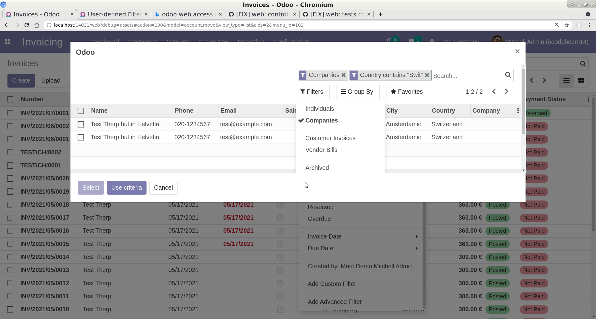

To use this module, you need to:

* Open *Filters* in a search view
* Select any relational field
* Select operator `is equal to` or `is not equal to`
* The text field changes to a relational selection field where you
  can search for the record in question
* Click *Apply*

To search for properties of linked records (ie invoices for customers
with a credit limit higher than X):

* Open *Filters* in a search view
* Select *Add Advanced Filter*
* Edit the advanced filter
* Click *Save*

Note that you can stack searching for properties: Simply add another
advanced search in the selection search window. You can do
this indefinetely, so it is possible to search for moves belonging
to a journal which has a user who is member of a certain group etc.

Note also the domain dialog offers an editable preview in debug mode:
  .. image:: ../static/img/debug_mode.png

In Selection operator
~~~~~~~~~~~~~~~~~~~~~

It is also possible when having selected a relational field to filter on, to
choose for the 'is in selection' operator. This will result in opening a list view for
the related model, where it is possible either to select some records, and then use the
'Select' butto, or to enter filters on the related model, and then click the
'Use Criteria' button.

Example: select the 'Created By' field to filter Invoices, and then 'is in selection'
as operator:

Then select some records and click on the select button:

Only invoices created by the selected users will be shown:

Another example would be to filter on the invoice partners:

Now only invoices for partners that are companies, and are in a country with 'Swit' in
the name will be shown:

