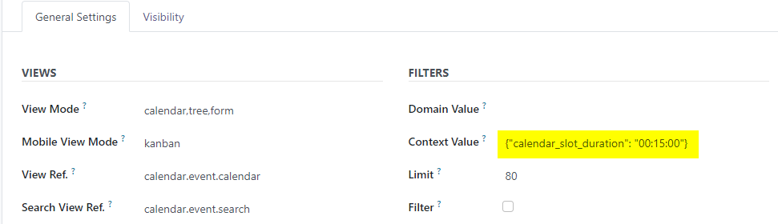
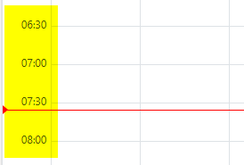

This documentation is for developers.

If you want to configure your calendar view's snap duration, make sure
that your window action includes a context similar to this (example is the
default value):

    {"calendar_slot_duration": "00:30:00"}

It can be added in actions defined on python or as
`ir.actions.act_window` records.

