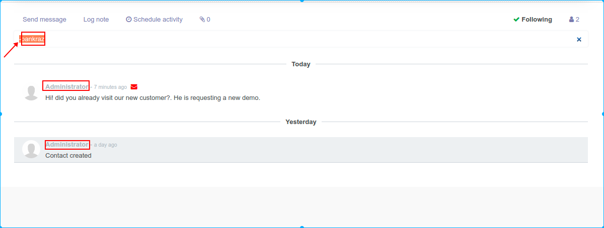

After working with Odoo a long time and load lot of loaded data, the amount of messages displayed inside the chatter of a record start to be significantly big

This module introduces a filter in the Chatter

Next functionalities are provided:
* Filter messages by content

* Filter messages by author

* Reverse filtering on author

F.ex. <-admin> will show all the messages in the chatt excluding the ones of the Administrator

