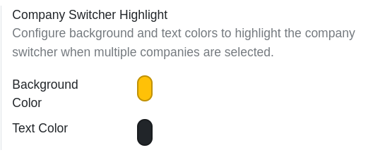

To configure the highlight colors:

1. Go to **Settings** > **General Settings**.
2. Scroll to the **Companies** section.
3. Under **Company Switcher Highlight**, set the desired **Background Color** and **Text Color** using the color pickers.
4. Click **Save**.

Alternatively, you can configure these values by modifying the following System Parameters (in debug mode, under **Settings** > **Technical** > **System Parameters**):

* `web_company_context_highlight.color`: The background color code (default: `#ffc107`).
* `web_company_context_highlight.text_color`: The text color code (default: `#212529`).
