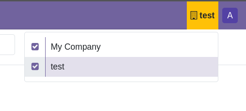
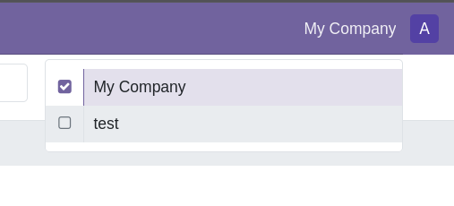

This module highlights the company switcher in the top bar of the web client when multiple companies are selected.

In a multi-company Odoo environment, users can easily lose track of their active company context. When more than one company is selected, they might unintentionally create or view records in the wrong context.

By applying a visual highlight to the company switcher when multiple companies are selected, this module provides an immediate visual cue, helping users remain aware of their active companies and reducing the risk of data entry errors.

* with multiple companies selected

  

* with one company selected

  
