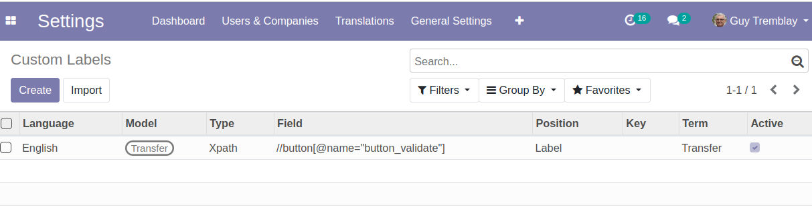
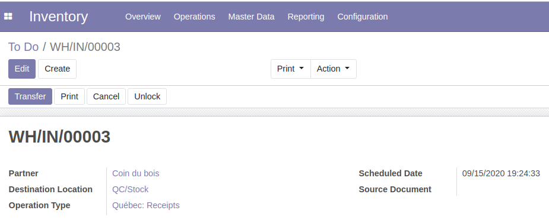

## Customizing Labels
In order to edit a label, you need to:

- Go to `Settings / Translations / Application Terms / Custom Labels`.
- Add a new custom label.
- Refresh your browser session in order to see the new label in your view.

Here is an example for products. We rename the field `Internal Reference` (default_code) with `SKU`.

Note that we selected 2 models to modify; `Product` and `Product Template`. This means we are modifying the label for both product templates and variants.

Now, if we go to any for product form view, we get the new label `SKU`.
    

    

## Customizing Placeholers
The module also allows to modify the placeholders of a form view.

Here, we set custom placeholders on the street fields of partners / addresses.

Partners have multiple form views in Odoo.

Here, we did not have to specify which form view to edit. The new placeholders are set in both the main partner form and the contact address form.

## Customizing Helpers
It is possible to customize a field helper.

## Customizing Selection Fields
Fields of type `Selection` can be customized.

In the list view of custom labels, a new position `Selection` and a column `Key` were added. The `Key` contains the technical value of the selection option to rename.

In the example above, the option `contact` of the field type of `res.partner` was renamed to `Personne` (in french).

In the form view of a contact, the term `Contact` is replaced with `Personne`.

## Customizing Buttons

In order to customize an element of the view that is not a field, we need to target the element with an Xpath expression.

Let's say we want to customize the stock picking view and change the ` VALIDATE` button to `TRANSFER`.

We add the custom label using an Xpath expression.

Then, the label is updated on the button.

## Comparison with Odoo Studio

When using Odoo Studio to modify a label, an inherited view is created behind the scene. Thus, each label added using Odoo Studio is coupled with the code. It adds complexity to deployments, because if the inherited view changes, the Studio customization may become incompatible.

Another downside is that when using Studio, you will need to edit every view of your model. For example, products and partners have multiple form views. If you change one label, you will need to change at multiple places.

The module `Web Custom Label` does not add additionnal XML. It modifies the view at the rendering, according to the language of the user. If the inherited view changes, the system will not fail. You may however end up with a wrong label inside a view and have to adjust the custom label entry.

[def]: ../static/description/general_settings.png
