## Access to the module
As system administrator, I go to *Settings / Technical / User Interface / Custom Modifiers*.
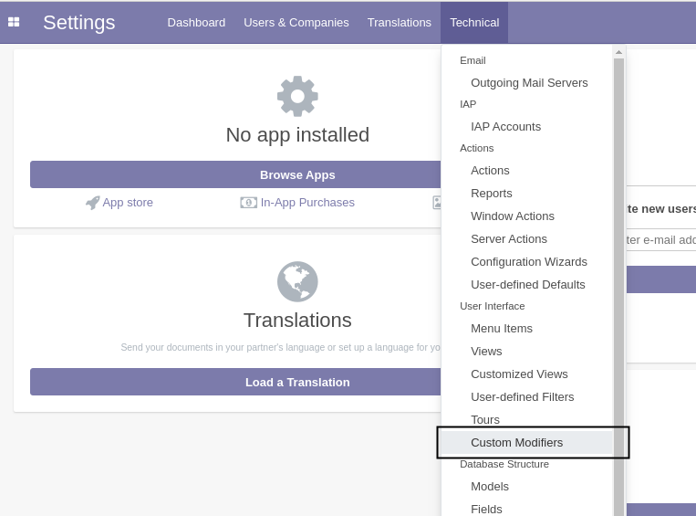

## Requiered Field
I create a new custom modifier.
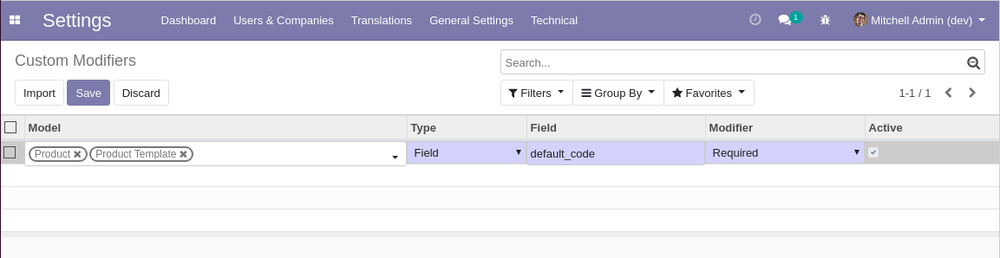

The modifier is configured to make the field `default_code` of a product required.

After refreshing my screen, I go to the form view of a product.

I notice that the field `default_code` is required.
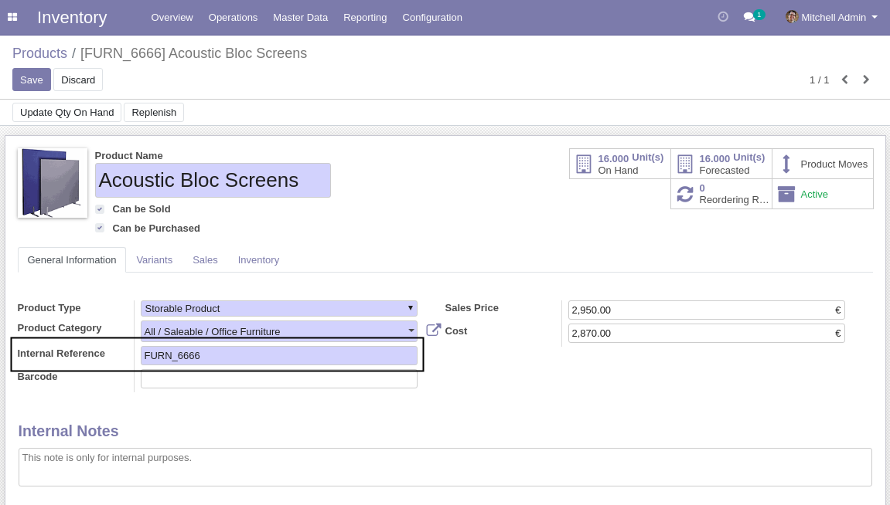

## Hide selection item
The module allows to hide an item (option) of a selection field.
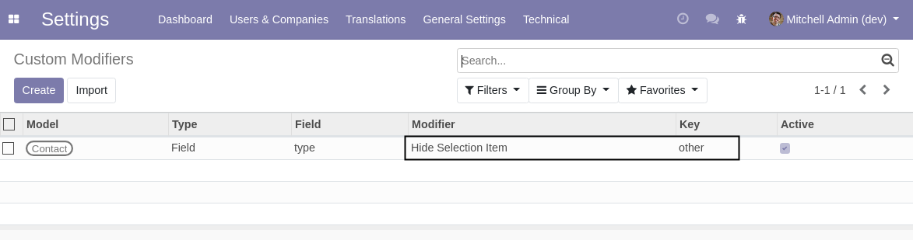

The above example hides the type of address `Other`.
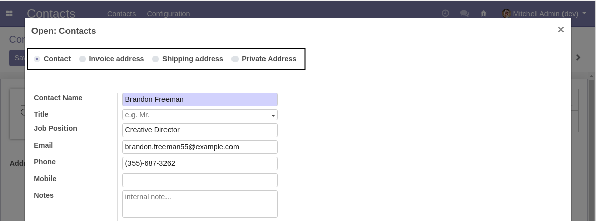

Beware that if the hidden option is already selected on a record, it will look as it was never set.
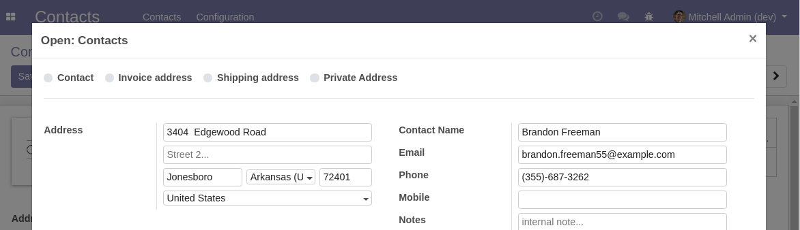

Therefore, this feature should only be used to hide options that are never used.

## Force Save
A new option `Force Save` is available.
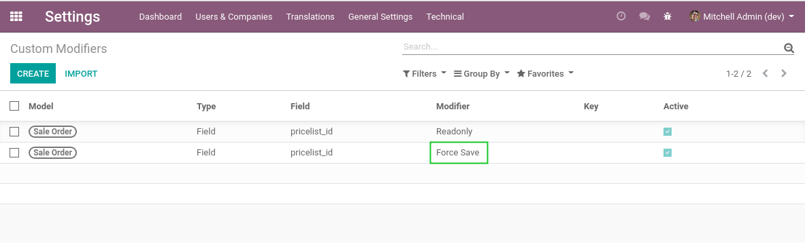

This modifier may be used along with the `Readonly` modifier so that the field value is saved to the server.

## Custom Widget
It is possible to customize the widget used for a given field.
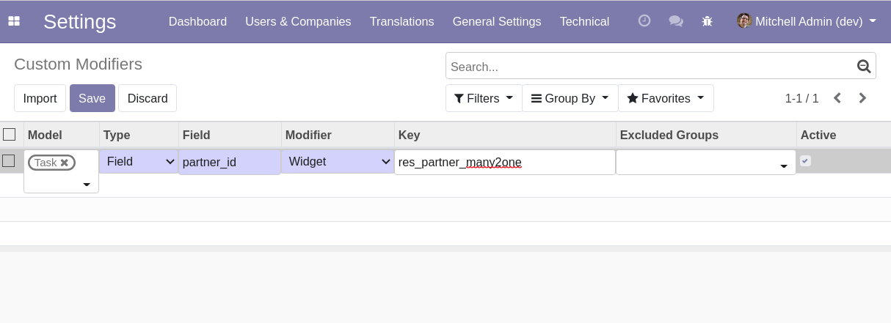
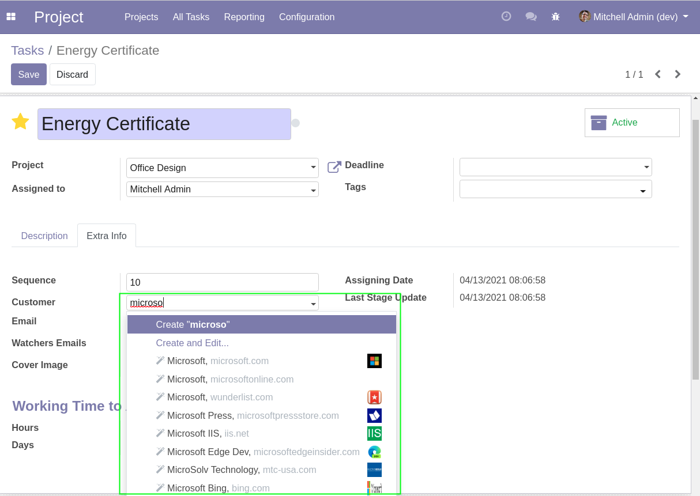

## Number of lines per page (List Views)
A new modifier is added to set the number of lines per page in list view.

In the following example, we set a limit of 20 sale order lines per page on a sale order form view.

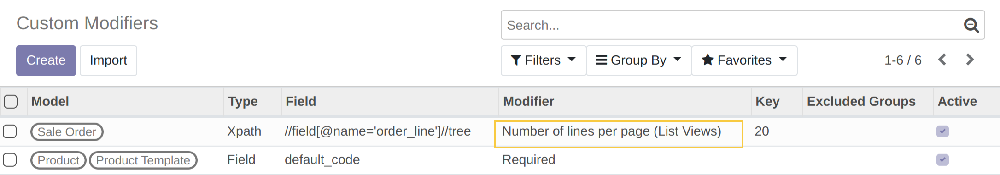
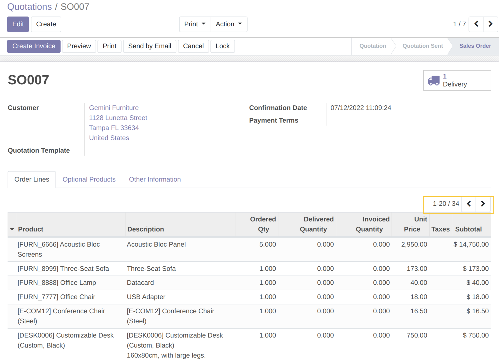

## Advanced Usage
In the field `Type`, I can select `Xpath`. This allows to set a modifier for a specific view node, such as a button.
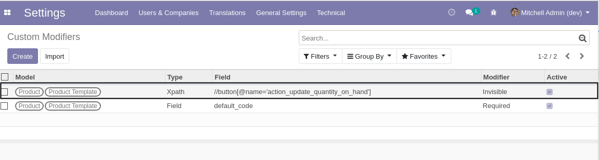
The example above hides the a button in the form view of a product.

## Excluded Groups
A new field `Excluded Groups` is available.
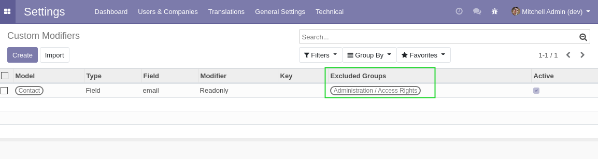

If at least one group of users is selected, the modifier is not applied for users that are member of any of these groups.

This is useful when rendering an element readonly or invisible only for a subset of users.

## Optional
Since the version **14.0.2.0.1**, it is possible to customize the optional of a given field on a tree view.

The `Optional` modifier takes 2 possible keys:
- show : To make the field displayed by default in the tree view.
- hide : To make the field hidden by default in the 3 dots of a tree view.

> [!IMPORTANT]
> The field must be present by default on the tree view and displayed.

Example:

As system administrator, I go to `Settings / Technical / User Interface / Custom Modifiers`.

I add the field name (labelled as `Number` in Quotation List View) of the model `sale.order`.

I select the modifier `Optional` and then set the key `show`.

I go to the Quotation List View and notice that the field is now shown by default and that it is possible to hide it.
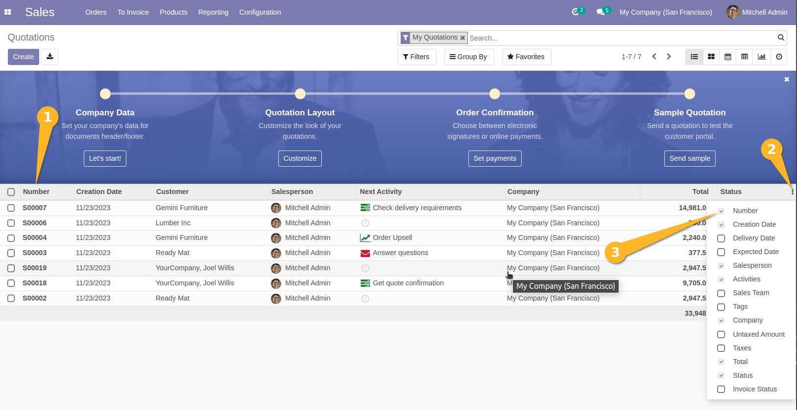

