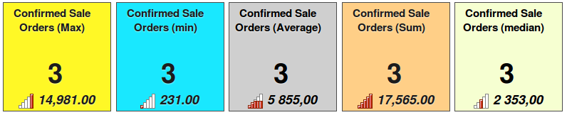
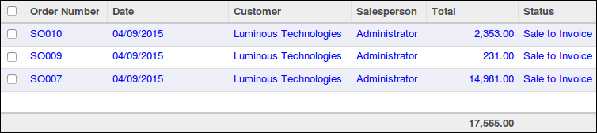

Add Tiles to Dashboard
======================

module to give you a dashboard where you can configure tile from any view
and add them as short cut.

* Tile can be:
    * displayed only for a user;
    * global for all users (In that case, some tiles will be hidden if
      the current user doesn't have access to the given model);
* The tile displays items count of a given model restricted to a given domain;
* Optionnaly, the tile can display the result of a function of a field;
    * Function is one of sum/avg/min/max/median;
    * Field must be integer or float;

Usage
=====

* Dashboad sample, displaying Sale Orders to invoice:

* Tree view displayed when user click on the tile:

Kown issues/limits
==================
* can not edit tile from dashboard (color, sequence, function, ...);
* context are ignored;
* combine domain of menue and filter so can not restore origin filter;

possible future improvments
===========================
* add icons;
* support client side action (like inbox);
* restore original Domain + Filter when an action is set.

Bug Tracker
===========

Bugs are tracked on `GitHub Issues <https://github.com/OCA/web/issues>`_.
In case of trouble, please check there if your issue has already been reported.
If you spotted it first, help us smashing it by providing a detailed and welcomed feedback
`here <https://github.com/OCA/web/issues/new?body=module:%20web_dashboard_tile%0Aversion:%208.0%0A%0A**Steps%20to%20reproduce**%0A-%20...%0A%0A**Current%20behavior**%0A%0A**Expected%20behavior**>`_.

Credits
=======

Contributors
------------

* Markus Schneider <markus.schneider at initos.com>
* Sylvain Le Gal (https://twitter.com/legalsylvain)
* Iván Todorovich <ivan.todorovich@gmail.com>

Maintainer
----------

.. image:: http://odoo-community.org/logo.png
    :alt: Odoo Community Association
    :target: http://odoo-community.org

This module is maintained by the OCA.

OCA, or the Odoo Community Association, is a nonprofit organization whose mission is to support the collaborative development of Odoo features and promote its widespread use.

To contribute to this module, please visit http://odoo-community.org.
