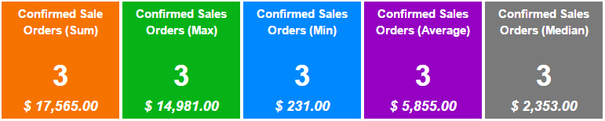

Dashboard Tiles
===============

Adds a dashboard where you can configure tiles from any view and add them as short cut.

By default, the tile displays items count of a given model restricted to a given domain.

Optionally, the tile can display the result of a function on a field.

- Function is one of `sum`, `avg`, `min`, `max` or `median`.
- Field must be integer or float.

Tile can be:

- Displayed only for a user.
- Global for all users.
- Restricted to some groups.

*Note: The tile will be hidden if the current user doesn't have access to the given model.*

Usage
=====

* Dashboad sample, displaying Sale Orders to invoice:

* Tree view displayed when user click on the tile:

Known issues
============
* Can not edit tile from dashboard (color, sequence, function, ...).
* Original context is ignored.
* Original domain and filter are not restored.
* To preserve a relative date domain, you have to manually edit the tile's domain from `Configuration > User Interface > Dashboard Tile`. You can use the same variables available in filters (`uid`, `context_today()`, `current_date`, `time`, `datetime`, `relativedelta`).

Roadmap
=======
* Add icons.
* Support client side action (like inbox).
* Restore original Domain + Filter when an action is set.
* Posibility to hide the tile based on a field expression.
* Posibility to set the background color based on a field expression.

Bug Tracker
===========

Bugs are tracked on `GitHub Issues <https://github.com/OCA/web/issues>`_.
In case of trouble, please check there if your issue has already been reported.
If you spotted it first, help us smashing it by providing a detailed and welcomed feedback
`here <https://github.com/OCA/web/issues/new?body=module:%20web_dashboard_tile%0Aversion:%208.0%0A%0A**Steps%20to%20reproduce**%0A-%20...%0A%0A**Current%20behavior**%0A%0A**Expected%20behavior**>`_.

Credits
=======

Contributors
------------

* Markus Schneider <markus.schneider at initos.com>
* Sylvain Le Gal (https://twitter.com/legalsylvain)
* Iván Todorovich <ivan.todorovich@gmail.com>

Maintainer
----------

.. image:: http://odoo-community.org/logo.png
    :alt: Odoo Community Association
    :target: http://odoo-community.org

This module is maintained by the OCA.

OCA, or the Odoo Community Association, is a nonprofit organization whose mission is to support the collaborative development of Odoo features and promote its widespread use.

To contribute to this module, please visit http://odoo-community.org.
