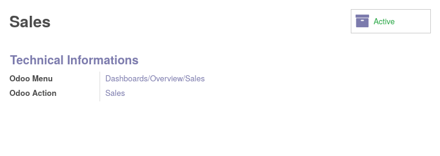
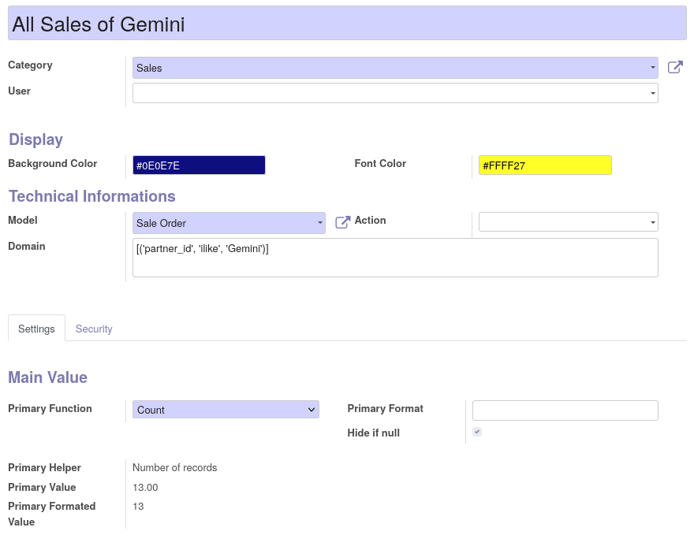
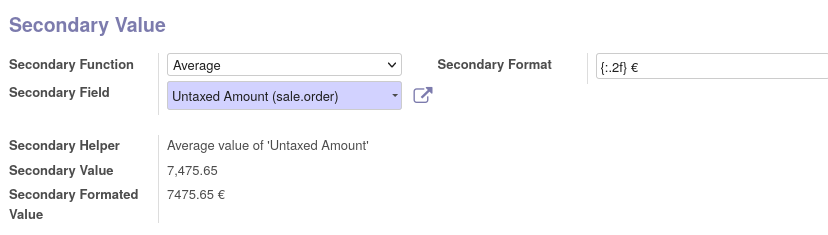

First, you have to create tile categories.

* Go to "Dashboards > Settings > Dashboard Categories"

* Click on Create

* Set a name, and save.

Odoo menu and action are automatically created.
You should refresh your browser to see new menu items.

Then you can create tiles.

* go to "Dashboards > Settings > Dashboard Tiles"

* create a new tile, set a name, a category and a model.

* You can optionally define colors, domain a specific action to use.

* Setting a user, or a group in "Security" tab will restrict the display of the tile.

You can optionally define a secondary value, for that purpose :

* Select a field, a function to apply.

* You can define a specific format. (``.format()`` python syntax)

