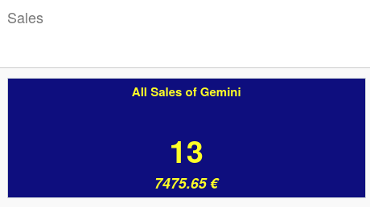
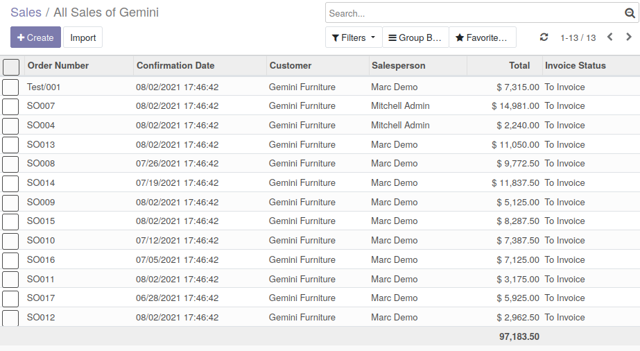
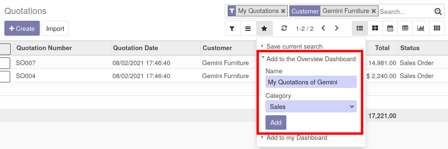
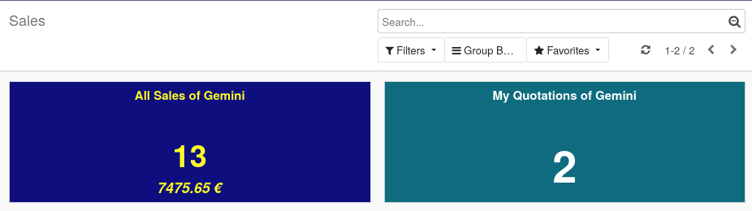

* Go to "Dashboard > Overview" and select a category

* The tile configured is displayed with the up to date count and average values of the selected domain.

* By clicking on the item, you'll navigate to the tree view of the according model.

**Note**

When you are in a tree view, with a domain, you can save it in the favorite menu, but the configuration is limited.

