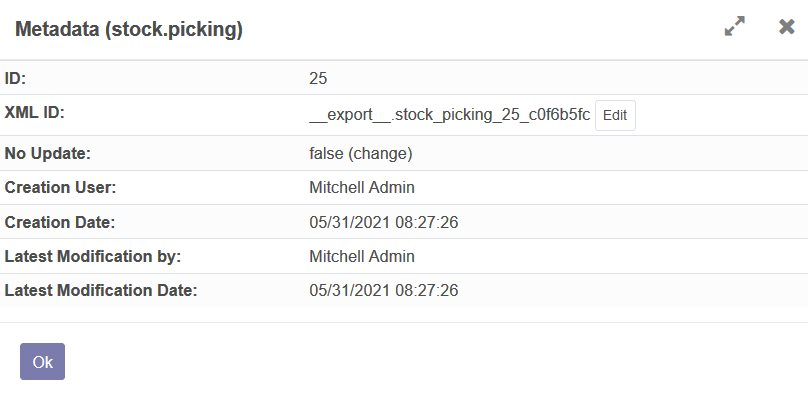

To use this module, you need to:

1.  Enable the debug mode to show the Developer menu.

2.  Click on View Metadata to open the built-in metadata viewer.

3.  If the record doesn't have an XML ID, the Create button will call
    the same built-in method used during a row export to generate a
    unique ID.

    *Create a new unique XML ID*

    

    *XML ID created*

    

4.  If the record is already linked to an XML ID, an Edit button will
    open a Form to update it.

    *Edit an existing XML ID*

    

    *XML ID editable form view*

    

    *XML ID edited*

    
