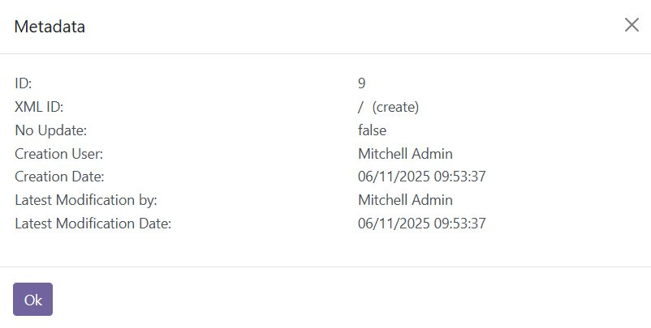
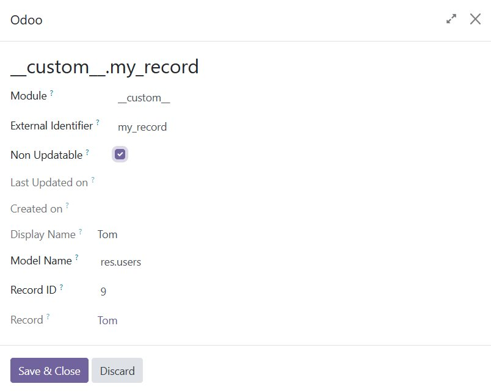
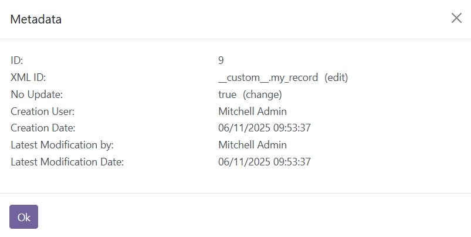
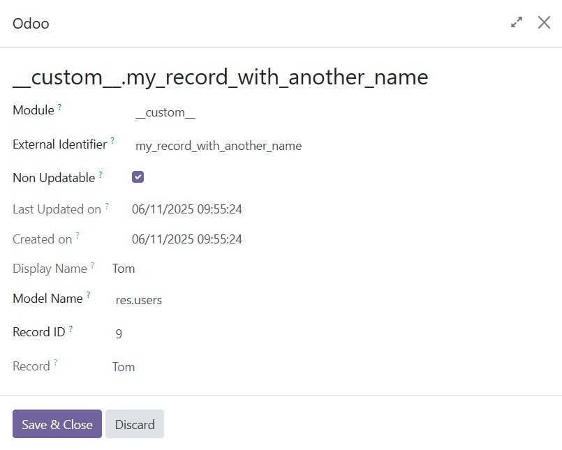
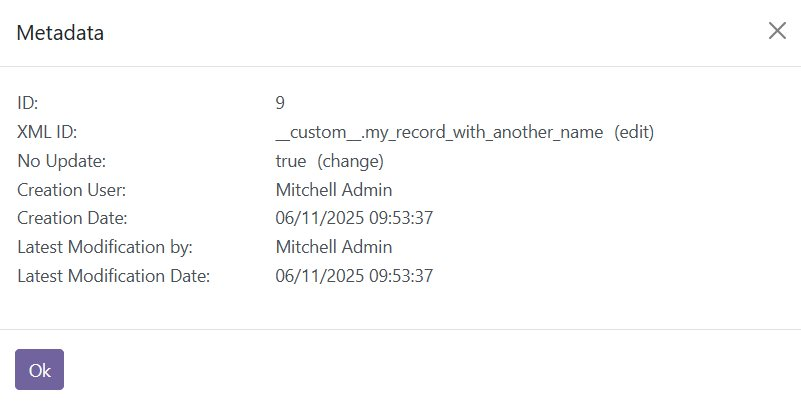

To use this module, you need to:

1.  Enable the debug mode to show the Developer menu.

2.  Click on `Metadata` to open the built-in metadata viewer.

3.  If the record doesn't have an XML ID, the `(create)` button will open
    the built-in dialog to edit it.

    *Create a new XML ID*

    

    

4.  If the record is already linked to one (and only one) XML ID, an `(edit)`
    button will open a Form to update it.

    *Edit an existing XML ID*

    

    *XML ID editable form view*

    

    *XML ID edited*

    
