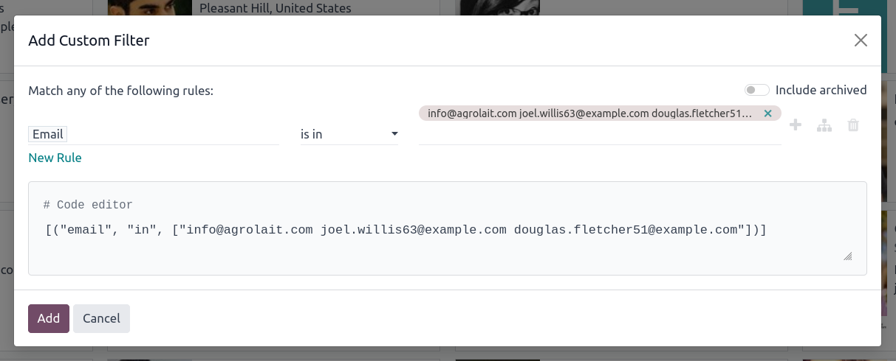
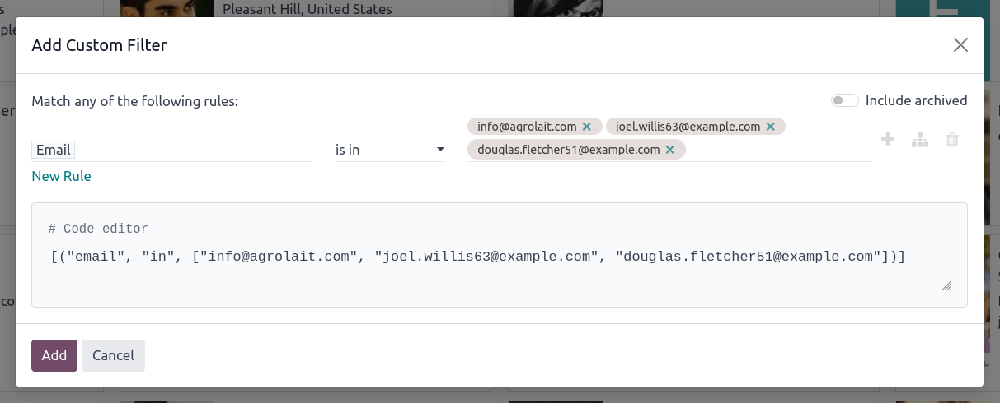

When using the **Add Custom Filter** dialog (Filters → Add Custom Filter)
with an **is in** or **is not in** operator, Odoo normally inserts pasted
text as a single value, even when the clipboard contains multiple lines.

When this module is installed, when a multi-line text is pasted in the
search value with the **is in** or **is not in** operator, it is
automatically expanded as one value per line, as if the user had typed
each value one by one. Each line becomes a separate tag in the filter:

