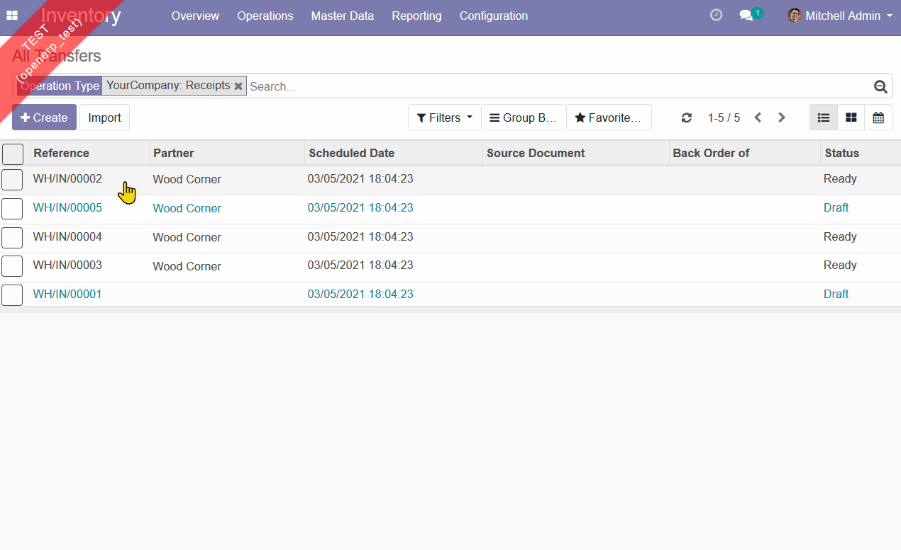

This module allow the current view to remember the last order set by the user
when clicking on one of the column of a one2many or many2many field.
That means that any refresh actions triggered by a button will restore last
ordered by.

