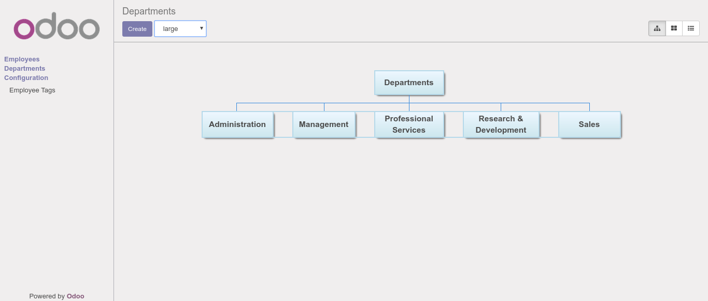

.. image:: https://img.shields.io/badge/licence-AGPL--3-blue.svg
    :target: http://www.gnu.org/licenses/agpl-3.0-standalone.html
    :alt: License: AGPL-3

Web Hierarchy
=============
This module adds a custom view to the standard odoo 10 views
whereby users can see a hierarchical chart view of the desired fields.
It works with two fields; **name** and **parent_id**.

Usage
=====
Install module and define a *parent_id* field and a *name* field.

Example
-------

.. code-block:: xml

    <?xml version="1.0" encoding="utf-8"?>
       <odoo>
        <record id="hr_employee_hierarchy_view" model="ir.ui.view">
            <field name="name">hr employee hierarchy</field>
            <field name="model">hr.employee</field>
            <field name="arch" type="xml">
                <hierarchy>
                    <field name="name"/>
                    <field name="parent_id"/>
                </hierarchy>
            </field>
        </record>
    </odoo>

Credits
=======

Contributors
------------

* Kevin Kamau <kevkamaa96@gmail.com>
* Tom Blauwendraat <tblauwendraat@therp.nl>

Do not contact contributors directly about support or help with technical issues.

Maintainer
----------

.. image:: https://odoo-community.org/logo.png
   :alt: Odoo Community Association
   :target: https://odoo-community.org

This module is maintained by the OCA.

OCA, or the Odoo Community Association, is a nonprofit organization whose
mission is to support the collaborative development of Odoo features and
promote its widespread use.

To contribute to this module, please visit https://odoo-community.org.
