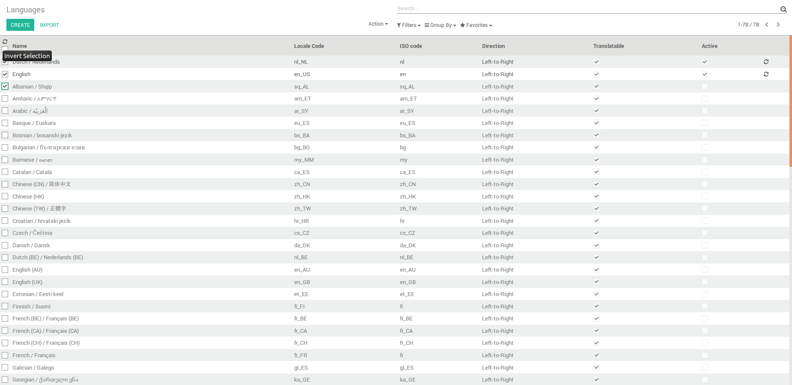
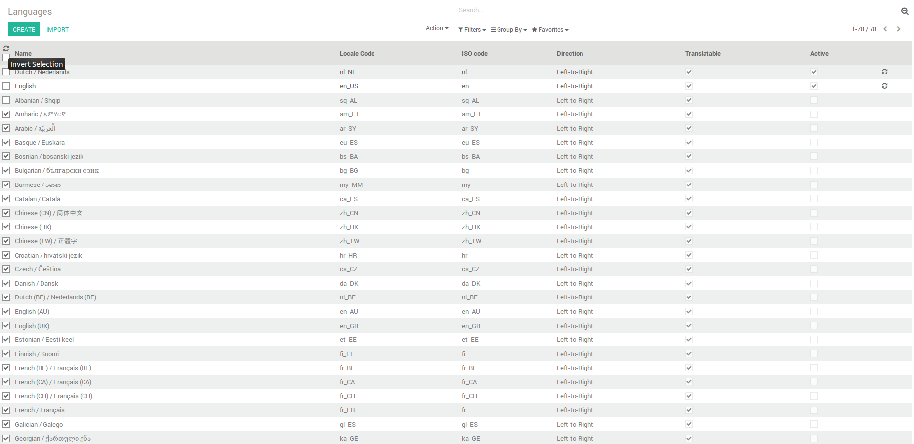

.. image:: https://img.shields.io/badge/licence-AGPL--3-blue.svg
   :target: http://www.gnu.org/licenses/agpl-3.0-standalone.html
   :alt: License: AGPL-3

=====================
List Invert Selection
=====================

Allow to invert the current selection of a list of records.

Configuration
=============

No configuration is needed.

Usage
=====

To use this module, you need to:

#. Go on any selectable list view;
#. Click on the "Invert Selection" button on the list header;

.. image:: https://odoo-community.org/website/image/ir.attachment/5784_f2813bd/datas
   :alt: Try me on Runbot
   :target: https://runbot.odoo-community.org/runbot/162/10.0

Bug Tracker
===========

Bugs are tracked on `GitHub Issues
<https://github.com/OCA/web/issues>`_. In case of trouble, please
check there if your issue has already been reported. If you spotted it first,
help us smash it by providing detailed and welcomed feedback.

Credits
=======

Contributors
------------

* Antonio Esposito <a.esposito@onestein.nl>
* Meet Dholakia <meetcomputer009@gmail.com>

Maintainer
----------

.. image:: https://odoo-community.org/logo.png
   :alt: Odoo Community Association
   :target: https://odoo-community.org

This module is maintained by the OCA.

OCA, or the Odoo Community Association, is a nonprofit organization whose
mission is to support the collaborative development of Odoo features and
promote its widespread use.

To contribute to this module, please visit https://odoo-community.org.
