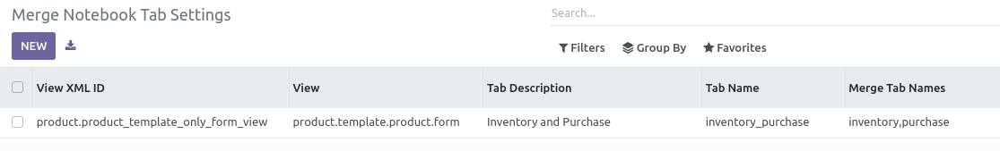

* Go to "Settings > Technical > User Interface > Merge Notebook tab Settings"

* Create a new setting:
    * Select the view you want to change
    * Set the description of the tab, that will be displayed to the user. (``string`` parameter)
    * Set the name of the tab, that will be used technically. (``name`` parameter)
    * set the names of the tabs you want to merge, as a python list.

