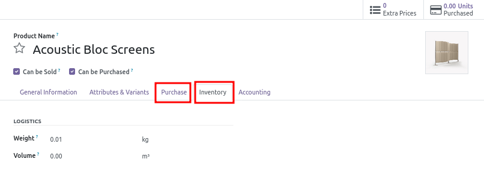
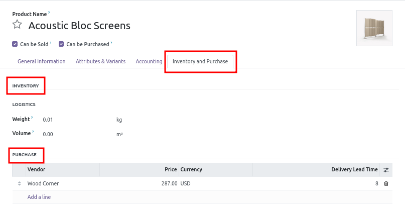

This module extend the Odoo Community Edition ``web`` module to improve display of Form views
that contains notebooks.

Odoo is very modular, that is great, but for some Forms, Odoo designs the view with a lot of tabs in a notebook,
one per functional topic.

If many modules are installed, it generates a lot of tabs. Consequently:

* it force users to click a lot of time in all the tabs, to configure all the data.
* it is not possible for a user to see quickly, if an item is correctly configured.

It is specially problematic for product or partner form views.

This module allows to 'merge' many tabs into a single tab, to avoid such UX troubles.

Demo exemple with the form view of the ``product.template`` model:

**Without the module**

**With the module**

