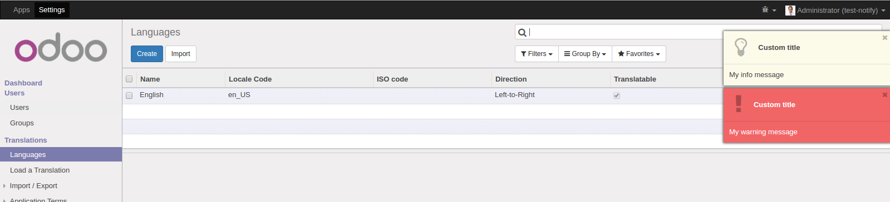

.. image:: https://img.shields.io/badge/licence-AGPL--3-blue.svg
   :target: http://www.gnu.org/licenses/agpl-3.0-standalone.html
   :alt: License: AGPL-3

==========
Web Notify
==========

Send instant notification messages to the user in live.

This technical module allows you to send instant notification messages from the server to the user in live. 
Two kinds of notification are supported.

* Warning: Displayed in a red flying popup div
* Information: Displayed in a light yellow flying popup div

To send a notification to the user you just need to call one of the new methods defined on res.users:

.. code-block:: python
  
   self.env.user.notify_info('My information message')

or 

.. code-block:: python
  
   self.env.user.notify_warning('My marning message') 

Installation
============

This module is based on the Instant Messaging Bus. To work properly, the server must be launched in gevent mode.

Usage
=====

.. image:: https://odoo-community.org/website/image/ir.attachment/5784_f2813bd/datas
   :alt: Try me on Runbot
   :target: https://runbot.odoo-community.org/runbot/162/10.0

Bug Tracker
===========

Bugs are tracked on `GitHub Issues
<https://github.com/OCA/web/issues>`_. In case of trouble, please
check there if your issue has already been reported. If you spotted it first,
help us smashing it by providing a detailed and welcomed feedback.

Credits
=======

Images
------

* Odoo Community Association: `Icon <https://github.com/OCA/maintainer-tools/blob/master/template/module/static/description/icon.svg>`_.

Contributors
------------

* Laurent Mignon <laurent.mignon@acsone.eu>
* Serpent Consulting Services Pvt. Ltd.<jay.vora@serpentcs.com>

Maintainer
----------

.. image:: https://odoo-community.org/logo.png
   :alt: Odoo Community Association
   :target: https://odoo-community.org

This module is maintained by the OCA.

OCA, or the Odoo Community Association, is a nonprofit organization whose
mission is to support the collaborative development of Odoo features and
promote its widespread use.

To contribute to this module, please visit https://odoo-community.org.
