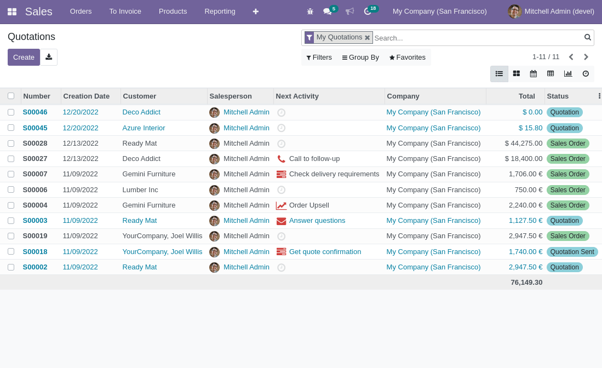

To send a notification to the user you just need to call one of the new
methods defined on res.users:

``` python
self.env.user.notify_success(message='My success message')
```

or

``` python
self.env.user.notify_danger(message='My danger message')
```

or

``` python
self.env.user.notify_warning(message='My warning message')
```

or

``` python
self.env.user.notify_info(message='My information message')
```

or

``` python
self.env.user.notify_default(message='My default message')
```

The notifications can bring interactivity with some buttons.

- One allowing to refresh the active view
- Another allowing to send a window / client action

The reload button is activated when sending the notification with:

The action can be used using the `action` keyword and we can choose
which name to give to our button with the `button_name` key in the
action context params key:

``` python
action = self.env["ir.actions.act_window"]._for_xml_id('sale.action_orders')
action.update({
   'res_id': self.id,
   'views': [(False, 'form')],
})
action["context"].setdefault("params", {})
action["context"]["params"]["button_name"] = "Sales"
action["context"]["params"]["button_icon"] = "fa-eye"
self.env.user.notify_info('My information message', action=action)
```



You can test the behaviour of the notifications by installing this
module in a demo database. Access the users form through Settings -\>
Users & Companies. You'll see a tab called "Test web notify", here
you'll find two buttons that'll allow you test the module.


