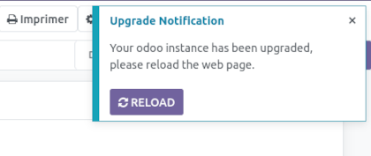

This module uses web_notify send a notification to every active users whenever a module has been installed or upgraded.

The notification will ask the user to refresh the page to get the latest changes.

