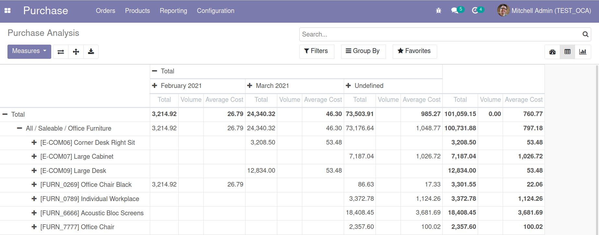
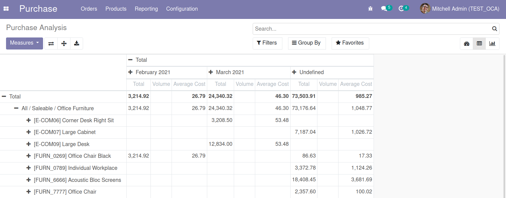

In some cases, we want to use the columns of a pivot view
to compare datas, but the total sum displayed in the last column
juste makes no sens.

This module intends to hide that last total column when required.

\

