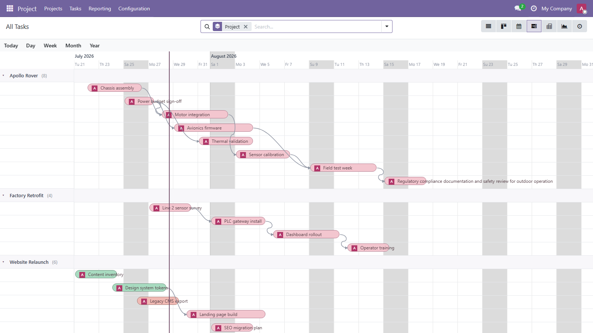
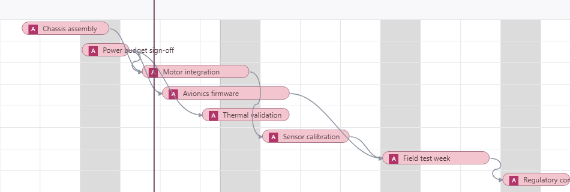
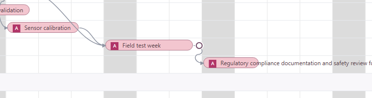
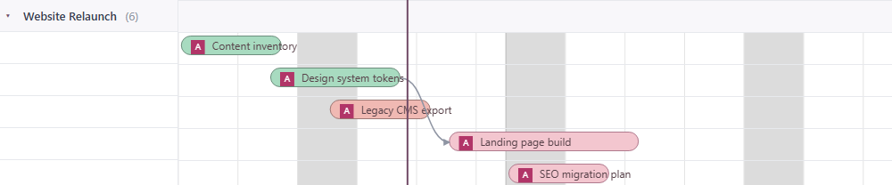

This module layers an Enterprise-style Gantt UX on top of `web_timeline`
views, opt-in per view and implemented purely with `patch()`: `web_timeline`
itself is not modified and views that do not opt in keep stock look and
behavior.

Features:

- **Row per record** under collapsible group header bands with record counts;
  collapse state persists to localStorage. Record names render on the bars
  and overflow narrow pills (Enterprise-style labels); the sidebar carries
  only the group bands.
- **Light theme via CSS design tokens**: the view's `colors=` rules render as
  harmonized pills, weekends and the today column are shaded, today's axis
  label becomes a pill, and the window stays anchored: the view never
  re-zooms after an edit.
- **Dependency arrows** drawn as Bezier curves from predecessor end to
  successor start, with hover tooltips.

- **Drag-to-link**: hover a bar and drag the circular handle at its end onto
  another bar to create the dependency. Client-side validation rejects
  self/duplicate/reverse links; a dashed pending arrow shows while the write
  is in flight; the success toast offers Undo; per-record gating via an
  `allow_task_dependencies`-style related field is respected when the model
  exposes one.

- **Arrow removal**: click an arrow (or focus it and press Delete) and
  confirm.
- **Dependency-aware moves**: dragging a bar whose record has dependents asks
  whether the downstream chain shifts by the same delta, the record moves
  alone, or the move is cancelled (the bar snaps back). Multi-select drags
  get a single prompt.

