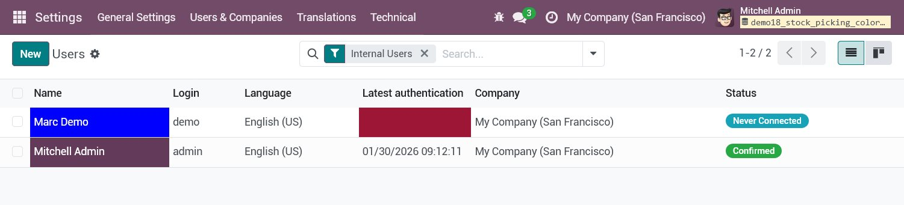
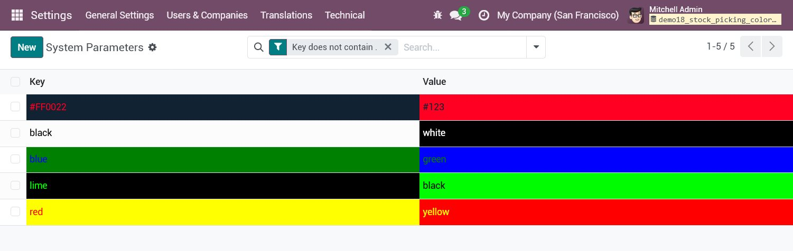
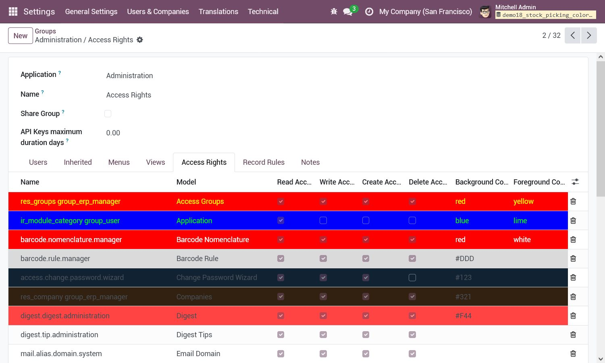

This module aims to add support for dynamically coloring fields in list view according
to data in the record.

## Features

- Add attribute `bg_color` on field's `options` to color background of a cell in list
  view
- Add attribute `fg_color` on field's `options` to change text color of a cell in list
  view
- Add attribute `bg_color_field` on list's `colors` to change background color of the
  entire row in list view (\*)
- Add attribute `fg_color_field` on list's `colors` to change text color of the entire
  row in list view (\*)

(\*) This functionality only works for a list defined in a form. (Since 13.0, the
`colors` attribute is no longer in the RelaxNG schema of the list view, so we can't use
it like before, but it looks like the RNG is not checked for embedded list.)

## Testing

Some views are overriden for demoing this module functionnalities:

### Demo of field static colors or colors based on conditions

On the Users list view: The `name` and `login_date` fields are colored according to
conditions written in view definition.

### Demo of field dynamic colors based on another field text content that returns the wanted color (background/foreground)

On the System Parameters list view, create a new key/value pair:

- For the `key` field: Its content is the text color, the `value` field is its
  background color.
- For the `value` field: Its content is the background color, the `value` field is the
  text color.

### Demo of row dynamic colors based on a fields text content that returns the wanted color (background/foreground)

On the Groups form view > "Access Rights": Two demo fields have been added, one to set
the background color and the other one for the foreground color, to test it you just
have to set a color (eg: blue, yellow, #00FDF0), the entire row background/foreground
colors are immediatly updated.

