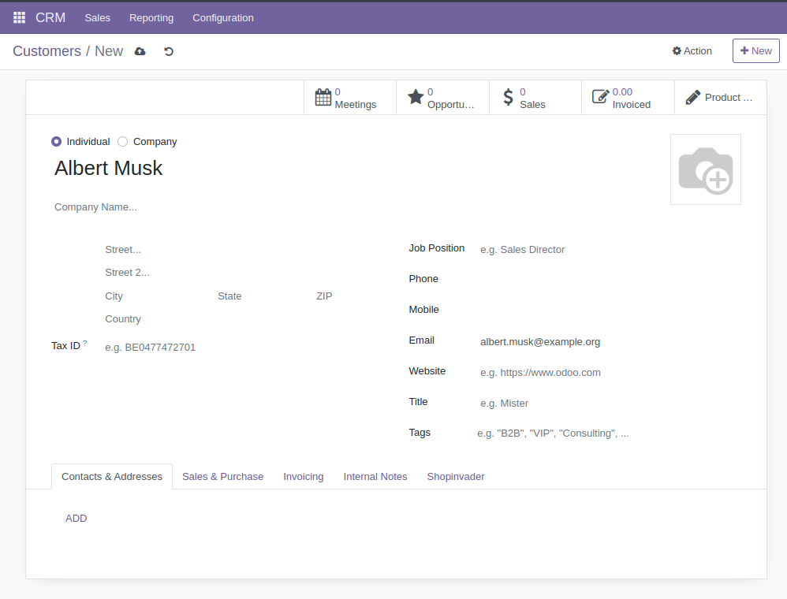

Prefill form fields directly from URL:

https://odoo.example.org/web#action=base.action_partner_form&view_type=form&res.partner_default_name=Albert%20Must&res.partner_default_email=albert.must%40example.org

Will directly open the partner form view with the name and email prefilled: 

It also handles changing the url fragment without reloading the page, 
updating the form fields accordingly.

The url default parameters will be kept in the url and therefore in browser history
to allow leaving the page and coming back to it with the browser back button.
