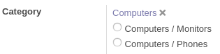

This module allows to use a new widget for many2one fields that are made hierarchically.
Now, you can navigate easily between the hierarchy.

When we are using readonly, the behaviour is similar than Many2one, but on edition
we are able to select the parents and childs in order to navigate properly.

