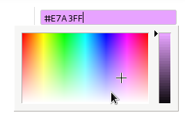
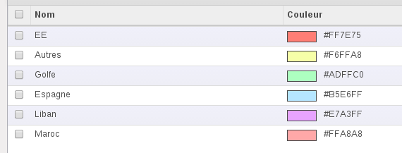

===========================
Odoo web_widget_color module
===========================

This module aims to add a color picker to Odoo.

It's a `jsColor <http://jscolor.com/>`_ lib integration.

Features
========

* The picker allow the user to quickly select a color on edit mode

  |picker|

  .. note::

      Notice how html code and the background color is updating when selecting a color.

* Display the color on form view when you are not editing it

  |formview|

* Display the color on list view to quickly find what's wrong!

  |listview|

Requirements
============

This module has been ported to 8.0

Usage
=====

You need to declare a char field of at least size 7::

    _columns = {
        'color': fields.char(
            u"Couleur",
            help=u"Toutes couleur valid css, exemple blue ou #f57900"
        ),
    }

    OR

    color = fields.Char(
        string="Color",
        help="Choose your color"
    )

In the view declaration, put widget='color' attribute in the field tag::

    ...
    <field name="arch" type="xml">
        <tree string="View name">
            ...
            <field name="name"/>
            <field name="color" widget="color"/>
            ...
        </tree>
    </field>
    ...

