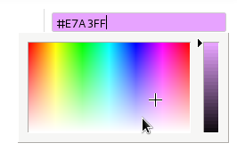
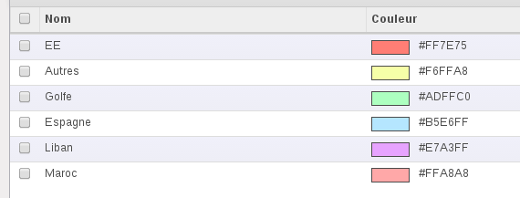

Color widget for Odoo web client
================================

This module aims to add a color picker to Odoo.

It's a `jsColor <http://jscolor.com/>`_ lib integration.

Features
========

* The picker allow the user to quickly select a color on edit mode

  |picker|

  .. note::

      Notice how html code and the background color is updating when selecting a color.

* Display the color on form view when you are not editing it

  |formview|

* Display the color on list view to quickly find what's wrong!

  |listview|

Usage
=====

You need to declare a char field::

    color = fields.Char(
        string="Color",
        help="Choose your color"
    )

In the view declaration, put widget='color' attribute in the field tag::

    ...
    <field name="arch" type="xml">
        <tree string="View name">
            ...
            <field name="color" widget="color"/>
            ...
        </tree>
    </field>
    ...
    <field name="arch" type="xml">
        <form string="View name">
            ...
            <field name="color" widget="color"/>
            ...
        </form>
    </field>
    ...

.. image:: https://odoo-community.org/website/image/ir.attachment/5784_f2813bd/datas
   :alt: Try me on Runbot
   :target: https://runbot.odoo-community.org/runbot/162/11.0

Bug Tracker
===========

Bugs are tracked on `GitHub Issues
<https://github.com/OCA/OCA/issues>`_. In case of trouble, please
check there if your issue has already been reported. If you spotted it first,
help us smashing it by providing a detailed and welcomed feedback.

Credits
=======

Contributors
------------

* Adil Houmadi <adil.houmadi@gmail.com>
* Enric Tobella <etobella@creublanca.es>
* Nicolas JEUDY (Sudokeys) <https://www.github.com/njeudy>

Maintainer
----------

.. image:: https://odoo-community.org/logo.png
   :alt: Odoo Community Association
   :target: https://odoo-community.org

This module is maintained by the OCA.

OCA, or the Odoo Community Association, is a nonprofit organization whose
mission is to support the collaborative development of Odoo features and
promote its widespread use.

To contribute to this module, please visit https://odoo-community.org.
