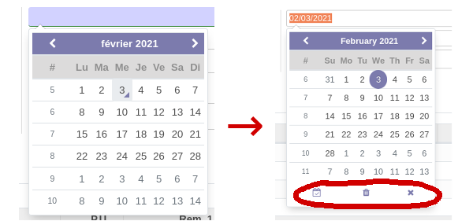

This module enables full options in datepicker used in date fields :
- Choose today's date in one click
- Two buttons enabled : choosing today and closing datepicker with selected date

Clearing field doesn't work because there is a left 'todo' in Odoo core code
here : https://github.com/odoo/odoo/blob/16.0/addons/web/static/lib/tempusdominus/tempusdominus.js#L1341
