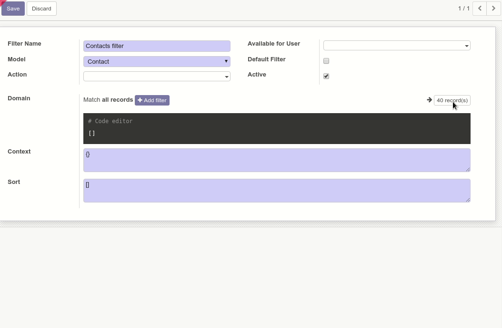

In any view with a domain field widget and model, but we'll make the example
with a user filter:

#. Enter debug mode.
#. Go to the *Debug menu* and select the option *Manage Filters*
#. Create a new one
#. Put a name to the filter and select a model (e.g.: Contact)
#. Click on the record selection button and a list dialog opens. There you can
   either:

  * Select individual records: those ids will be added to the domain.
  * Set filters that will be applied to the domain and select all the records
    to add it as a new filter.
  * Set groups that will be converted into search filters, select all the
    records and those unfolded groups will be set as filters to.

You can still edit the filter with Odoo's widget after that.

