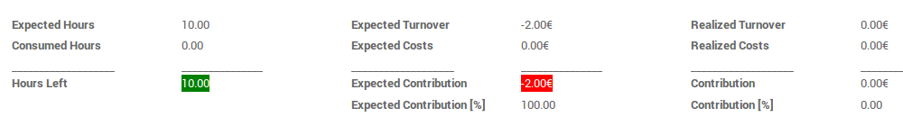
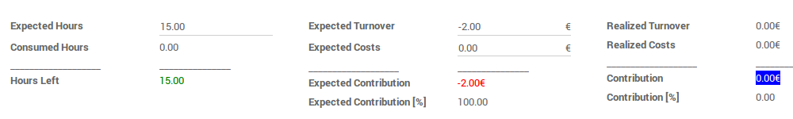

.. image:: https://img.shields.io/badge/licence-AGPL--3-blue.svg
   :target: http://www.gnu.org/licenses/agpl-3.0-standalone.html
   :alt: License: AGPL-3

=====================
Highlight Float Field
=====================

This module extends the functionality of web backend to allow user to highlight
any numeric field when its value belongs to a given interval, both in form and pivot views.

Usage
=====

For working, this module defines 3 distinct numeric intervals separated by two
values which are called thresholds. If we call T1 and T2 the two thresholds,
assuming that T1 <= T2, the three intervals are so defined:

- Lower:  each number < T1;
- Middle: each number included between T1 and T2 (including T1 and T2 as well);
- Upper:  each number > T2;

For each of these intervals is setted a background-color and a text-color;
for numeric fields which use the highlight functionality, whenever their value
belongs to one of these three intervals, it's shown with the interval-related
color combination.

By default, T1 and T2 are set to 0, the lower-interval colors are red/white;
the middle-interval colors are white/grey and the upper interval colors are
green/white.
Therefore, by default, a numeric field with this option has a red background
(with white text) if it's a negative number, a green background (with white
text) if it's a positive number and keep the basic odoo style if it's equal to
0. By default, the highlight works only when the form view is not in edit mode.

To use the default settings, you have to enable them setting the option
'load_defaults' to True on a numeric field.

    <field name="my_numeric_field" options="{'load_defaults':True}"/>

Anyway it's possible to customize this behavior through several options you
can provide to the field. Such options are:

- lower_threshold (0 by default): T1, the lowest number into middle-interval;
- upper_threshold (0 by default): T2, the highest number into middle-interval;
- lower_bg_color (red by default): Background-color for lower-interval;
- middle_bg_color (white by default): Background-color for middle-interval;
- upper_bg_color (green by default): Background-color for upper-interval;
- lower_font_color (white by default): Text-color for lower-interval;
- middle_font_color (grey - by default): Text-color for middle-interval;
- upper_font_color (white by default): Text-color for upper-interval;
- always_work (False by default): If True the highlight works also in edit mode;

Be also aware that if you don't set the 'load_defaults' flag to True, the
default colors won't be loaded (therefore the field would be shown with the Odoo
standar style) but you can still provide any other option to customize its
behavior according to your wishes.

To avoid errors, don't use garbage values for the options above. In particular,
be aware that the function won't work if T1 > T2.

-------------------------------------------------------------------------------

It's also possible to highlight numeric cells in a pivot view, following
similar rules. To do so, provide the options above in the definition of the
pivot itself. This rule will be then loaded for the whole view.

   <pivot string="My Pivot View" options='{"load_defaults":"true"}'>

To choose on which column to enable this functionality, then, set on the wished
'measure' numeric field, the attribute 'highlight'.

   <field name="my_numeric_field" type="measure" highlight="true"/>

Known issues / Roadmap
======================

It's under analysis the improvement of this module. The idea is to condition
the highlight of a field to a more general condition than the mere belonging to
an interval. In order to achieve this, it's necessary to provide the user a
tool to write its own conditions.

Bug Tracker
===========

Bugs are tracked on `GitHub Issues
<https://github.com/OCA/web/issues>`_. In case of trouble, please
check there if your issue has already been reported. If you spotted it first,
help us smashing it by providing a detailed and welcomed feedback.

Credits
=======

Images
------

* Odoo Community Association: `Icon <https://github.com/OCA/maintainer-tools/blob/master/template/module/static/description/icon.svg>`_.

Contributors
------------

* Antonio Esposito <a.esposito@onestein.nl>

Maintainer
----------

.. image:: https://odoo-community.org/logo.png
   :alt: Odoo Community Association
   :target: https://odoo-community.org

This module is maintained by the OCA.

OCA, or the Odoo Community Association, is a nonprofit organization whose
mission is to support the collaborative development of Odoo features and
promote its widespread use.

To contribute to this module, please visit https://odoo-community.org.
