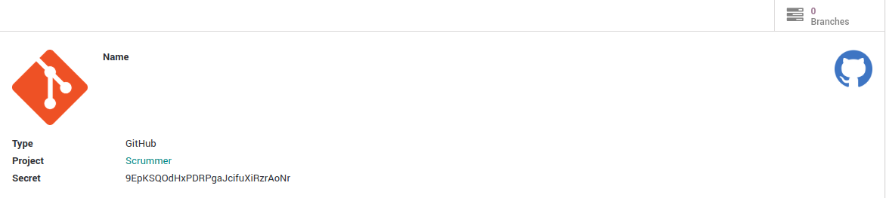

.. image:: https://www.gnu.org/graphics/lgplv3-147x51.png
   :target: https://www.gnu.org/licenses/lgpl-3.0.en.html
   :alt: License: LGPL-v3

=============
Web Image URL
=============

This module provides web widget for displaying image from URL on form and tree views.

Usage
=====

To use this module, you need to decorate xml field with widget ``image_url``.

.. code-block:: xml

    <field name="avatar" widget="image_url" class="oe_image_small" width="100px" height="100px"/>

Here's an examples of how images looks like on a form

Bug Tracker
===========

Bugs are tracked on `GitHub Issues
<https://github.com/OCA/web/issues>`_. In case of trouble, please
check there if your issue has already been reported. If you spotted it first,
help us smash it by providing detailed and welcomed feedback.

Credits
=======

Contributors
------------

* Petar Najman <petar.najman@modoolar.com>
* Sladjan Kantar <sladjan.kantar@modoolar.com>

Maintainer
----------

.. image:: https://odoo-community.org/logo.png
   :alt: Odoo Community Association
   :target: https://odoo-community.org

This module is maintained by the OCA.

OCA, or the Odoo Community Association, is a nonprofit organization whose
mission is to support the collaborative development of Odoo features and
promote its widespread use.

To contribute to this module, please visit https://odoo-community.org.
