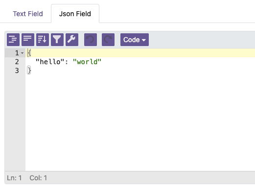
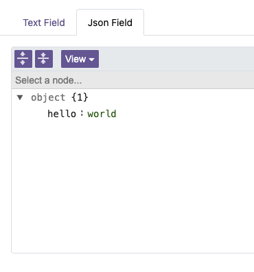

This module provides a JSON Editor widget for Odoo form views.

It wraps the popular
[JSONEditor](https://github.com/josdejong/jsoneditor) library and
provides:

- Syntax highlighting for JSON
- Schema-based validation and autocomplete
- Multiple view modes (code, view)
- Search functionality
- Undo/redo history

The module includes both a field widget (for use in form views) and a
reusable OWL component (for custom integrations).

**Code Mode:**

**View Mode:**

