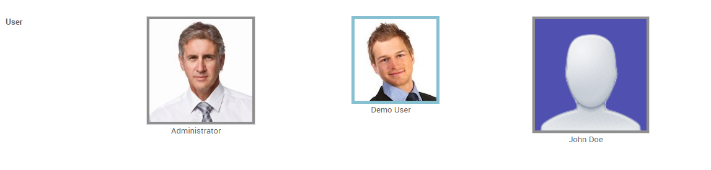

.. image:: https://www.gnu.org/graphics/lgplv3-147x51.png
   :target: https://www.gnu.org/licenses/lgpl-3.0.en.html
   :alt: License: LGPL-v3

==================
Web Many2One Image
==================

This module provides web widget for selecting a value for Many2one field from the displayed images.

Usage
=====

To use this module, you need to decorate xml field with widget ``m2o_image``.

.. code-block:: xml

    <field name="user_id" widget="m2o_image" />

Here's an examples of how widget looks like on a form view in read mode

Here's an examples of how widget looks like on a form view in edit mode

Bug Tracker
===========

Bugs are tracked on `GitHub Issues
<https://github.com/OCA/web/issues>`_. In case of trouble, please
check there if your issue has already been reported. If you spotted it first,
help us smash it by providing detailed and welcomed feedback.

Credits
=======

Contributors
------------

* Siddhant Pageni <siddhantpageni@gmail.com>

Maintainer
----------

.. image:: https://odoo-community.org/logo.png
   :alt: Odoo Community Association
   :target: https://odoo-community.org

This module is maintained by the OCA.

OCA, or the Odoo Community Association, is a nonprofit organization whose
mission is to support the collaborative development of Odoo features and
promote its widespread use.

To contribute to this module, please visit https://odoo-community.org.
