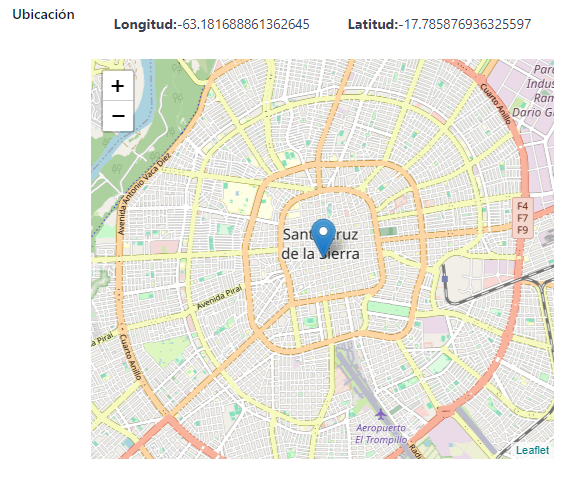

# Map field and widget

This new widget is a combination of the `map` field and the `map` widget. It allows you
to display a map in the form and to select a location by dragging a marker on the map.

## Configuration

## Field instance

The python instance of the field is `fields.Map`.

```python

from odoo import models, fields, api, _

_logger = logging.getLogger(__name__)

class MyModel(models.Model):
    _name = 'my.model'

    name = fields.Char(string='Name')
    location = fields.Map(string=_('Location'))

    @api.onchange('location')
    def _onchange_location(self):
        """
        This will be called when the location is changed.
        """
        if self.location:
            _logger.info('Location: %s', self.location)
```

Now lets implement the widget.

```xml
<odoo>
    <data>
        <record id="view_my_model_form" model="ir.ui.view">
            <field name="name">my.model.form</field>
            <field name="model">my.model</field>
            <field name="arch" type="xml">
                <form string="My Model">
                    <sheet>
                        <group>
                            <field name="name" />
                            <field name="location" widget="map" />
                        </group>
                    </sheet>
                </form>
            </field>
        </record>
    </data>
</odoo>
```

After that you will get this result:



## Thanks

I wanna thank Cybrosys Technologies for the documentation they maintain. I have used
their documentation as a reference to create this widget.

https://www.cybrosys.com/blog/how-to-create-a-widget-in-odoo-17
