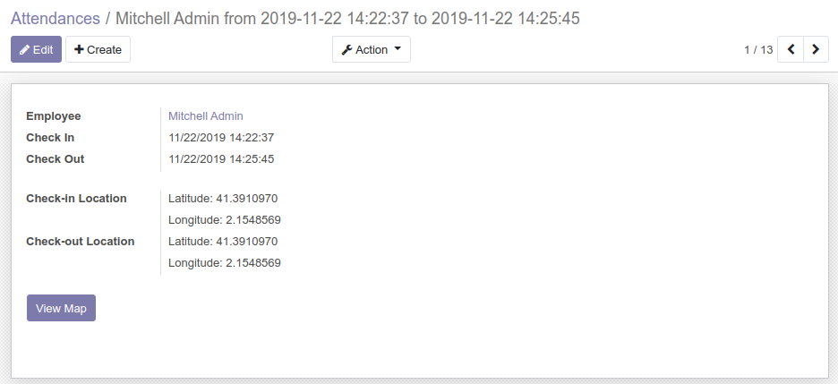
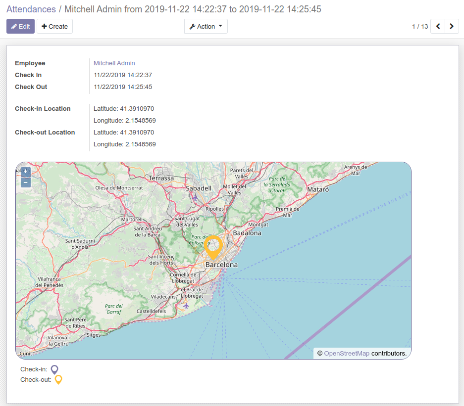

To insert a Bokeh chart in a view proceed as follows:

#. Add the widget in the view::

    <widget name='map_widget'/>

When the widget is set in a view, the user will see a button, clicking on
the button will render the map.

By default the center of the map is set to latitude 0 and longitude 0.
Refer to the module hr_attendance_geolocation_map to see an example on how
to set the center and display markers in the map.
