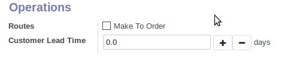
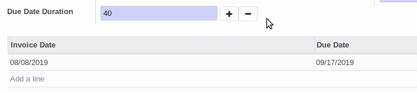

In your xml view, add ``widget="number_ux_choice"``
This will add the 2 buttons +" and "-" just next to the input field in edit mode.
Iteration step by default is 1.

.. figure:: ../static/description/add_two_buttons.png

**Optional**
Add an option to choose the step iteration
Example for an 0.1 step :

``<field name="sale_delay" widget="number_ux_choice" options="{'step': 0.1}" /> days``

**Examples**

Iteration with 0.1 step

Iteration with 10 step, with onchange

