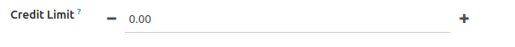

In your xml view, add ``widget="numeric_step"``
This will add the 2 buttons "+" and "-" just next to the input field in edit mode.
Iteration step by default is 1.

**Optional**

Add an option to choose the step iteration and limits (min and max values).

Example for an 0.25 step, min to -1 and max to 10 :

.. code:: xml

  <field name="sale_delay" widget="numeric_step" options="{'step': 0.25, 'min': -1, 'max': 10}" /> days

**Examples**

Iteration with 0.25 step, min to -1 and max to 10.

Start to increment with button, continue incrementing with scrolling mouse.

Iteration with 10 step, max limit 15, placeholder with onchange

