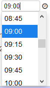
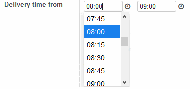

.. image:: https://img.shields.io/badge/licence-AGPL--3-blue.svg
   :target: http://www.gnu.org/licenses/agpl-3.0-standalone.html
   :alt: License: AGPL-3

===============================
Timepicker widget in form views
===============================

This module provides a timepicker widget for float fields.
It can be used as a replacement for the standard float_time widget in form views.

|picker|

The widget has the following default timepicker options:

* the possible selection is based on 15 minute interval (step: 15)
* 24 hour mode in H:i format (timeFormat: 'H:i')
* scroll selection starts at current time (scrollDefault: 'now')

|formview|

Usage
=====

In the form view declaration, put widget='timepicker' attribute in the field tag::

    ...
    <field name="arch" type="xml">
        <form string="View name">
            ...
            <field name="name"/>
            <field name="mytimefieldname" widget="timepicker"/>
            ...
        </form>
    </field>
    ...

Additional jquery-timepicker plugin options can be specified by an options attribute::

    ...
    <field name="mytimefieldname" widget="timepicker" options="{'step': '30', 'disableTextInput': false}"/>
    ...

See the available options at `jquery-timepicker <https://github.com//jonthornton//jquery-timepicker#timepicker-plugin-for-jquery>`_.

Credits
=======

* The module uses the `jquery-timepicker <https://github.com//jonthornton//jquery-timepicker#timepicker-plugin-for-jquery>`_. plugin by Jon Thornton. This software is made available under the open source MIT License. © 2014 Jon Thornton and contributors

* Odoo Community Association (OCA)

Contributors
------------

* Michael Fried <Michael.Fried@vividlab.de>
* Kaushal Prajapati <kbprajapati@live.com>

Maintainer
----------

.. image:: https://odoo-community.org/logo.png
   :alt: Odoo Community Association
   :target: https://odoo-community.org

This module is maintained by the OCA.

OCA, or the Odoo Community Association, is a nonprofit organization whose
mission is to support the collaborative development of Odoo features and
promote its widespread use.

To contribute to this module, please visit https://odoo-community.org.