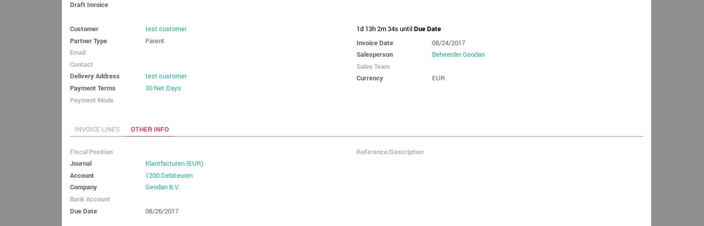
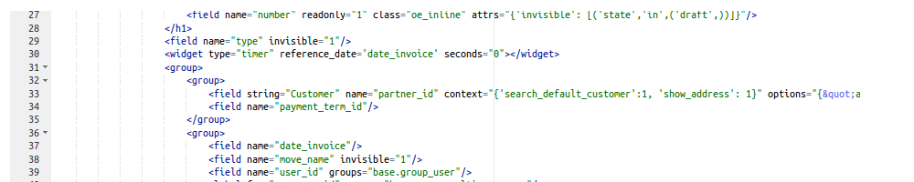
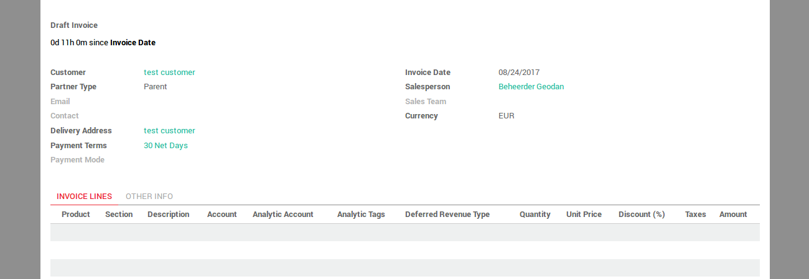

.. image:: https://img.shields.io/badge/licence-AGPL--3-blue.svg
   :target: http://www.gnu.org/licenses/agpl-3.0-standalone.html
   :alt: License: AGPL-3

================
Web Widget Timer
================

This module introduces a new timer widget to be used in form views.

Usage
=====

To use the timer widget in a form view you need to relate it to a date field
also present in the view (ref_date in the example below).

   <widget type="timer" reference_date='ref_date'></widget>

By default, the timer will count up from the referred date, showing, in black,
days, hours, minutes and seconds past since the referred date. If the referred
date is in the future, instead, the timer will show the same informations in red.

Anyway it's possible to customize this behavior through several attributes you
can provide to the widget. Such options are:

- counting (accepts 'up' and 'down'; 'up' is default): if it's set to down, the widget's behavior is inverted and it will count down to the referred date;
- hours (accepts '0' and '1'; '1' is default): if it's set to 0, the widget won't show hours;
- minutes (accepts '0' and '1': '1' is default): if it's set to 0, the widget won't show minutes;
- seconds (accepts '0' and '1': '1' is default): if it's set to 0, the widget won't show seconds;

The example below will render a down-counting timer which only shows days and hours:

   <widget type="timer" reference_date='ref_date' counting='down' seconds='0' minutes='0'></widget>

The widget dinamically adapts to changes on the referred date and it's automatically hidden if the referred date is not set.

.. figure:: static/description/code_down.png
   :alt: Code for Down-Counting Timer

.. image:: https://odoo-community.org/website/image/ir.attachment/5784_f2813bd/datas
   :alt: Try me on Runbot
   :target: https://runbot.odoo-community.org/runbot/162/10.0

Bug Tracker
===========

Bugs are tracked on `GitHub Issues
<https://github.com/OCA/web/issues>`_. In case of trouble, please
check there if your issue has already been reported. If you spotted it first,
help us smash it by providing detailed and welcomed feedback.

Credits
=======

Contributors
------------

* Antonio Esposito <a.esposito@onestein.nl>

Maintainer
----------

.. image:: https://odoo-community.org/logo.png
   :alt: Odoo Community Association
   :target: https://odoo-community.org

This module is maintained by the OCA.

OCA, or the Odoo Community Association, is a nonprofit organization whose
mission is to support the collaborative development of Odoo features and
promote its widespread use.

To contribute to this module, please visit https://odoo-community.org.
