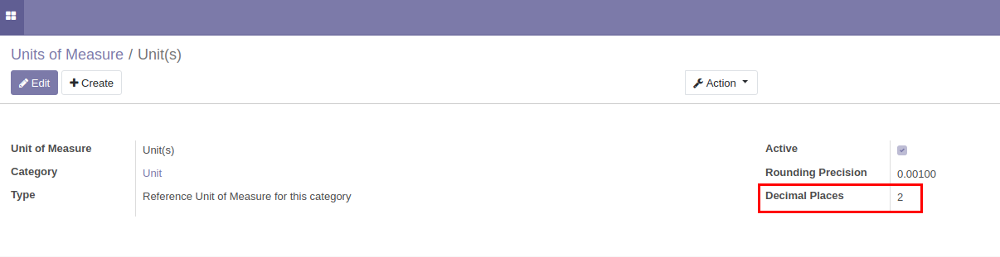

In the UoM form view specify the number of decimal places that
should be displayed for each unit of Measure:

In the view declaration, put widget='uom' attribute in the field tag::

    ...
    <field name="arch" type="xml">
        <tree string="View name">
            ...
            <field name="" widget="uom"/>
            ...
        </tree>
    </field>
    ...
    <field name="arch" type="xml">
        <form string="View name">
            ...
            <field name="" widget="uom"/>
            ...
        </form>
    </field>
    ...

Widget Options::

    ...
    <field name="arch" type="xml">
        <tree string="View name">
            ...
            <field name="color" widget="color" options="{'uom_field': 'product_uom'}"/>
            ...
        </tree>
    </field>
    ...

If the UoM field in the model is not declared under the name uom_id, the
option uom_field must be specified with the appropriate field name.
