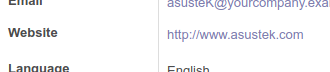
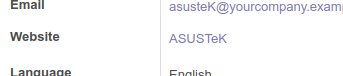

Use url widget as you do usually, then add an extra parameter text_field
to indicate which field (present in the view already) must be used for
the anchor text.

``` xml
<field name="some_url" widget="url" text_field="another_field" />
```

M2O fields are supported: display_name is used automatically.

For example, in the partner form, if you want to display the website
link with partner's name as anchor you can do:

``` xml
<field name="website" widget="url" text_field="name" placeholder="e.g. www.odoo.com"/>
```

This is going to change the rendering from



to



Or user can add any hyperlink text using 'prefix_name' attribute

``` xml
<field name="skype_name" widget="url" prefix_name="skype"/>
```

both can be applied inside the options attribute too:

``` xml
<field name="skype_name" widget="url" options="{'prefix_name': 'skype'}"/>
```
