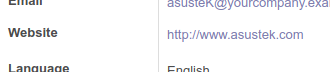
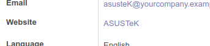

Use `url` widget as you do usually, then add an extra parameter `text_field`
to indicate which field (present in the view already) must be used for the anchor text.

.. code-block:: xml

    <field name="some_url" widget="url" text_field="another_field" />

M2O fields are supported: `display_name` is used automatically.

For example, in the partner form,
if you want to display the website link with partner's name as anchor you can do:

.. code-block:: xml

    <field name="website" widget="url" text_field="name" placeholder="e.g. www.odoo.com"/>

This is going to change the rendering from

to

