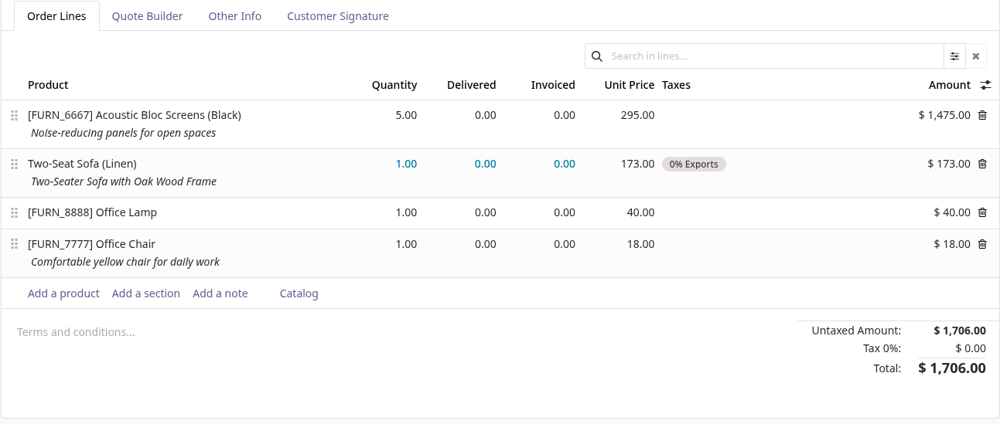
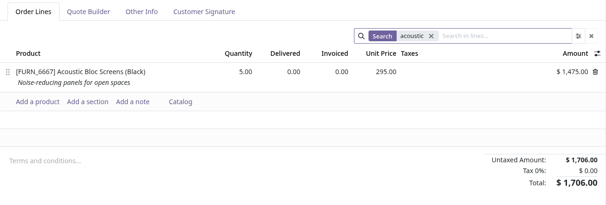
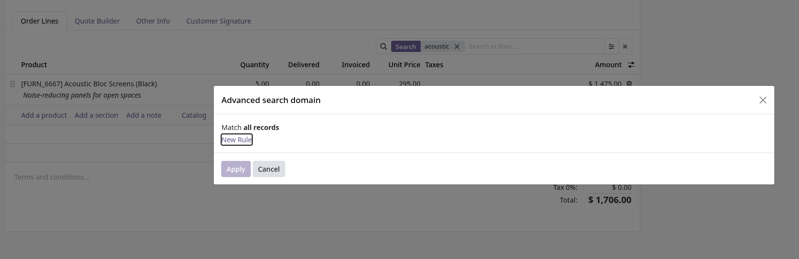

This module adds an optional **inline quick search** to x2many embedded lists inside form views.

It is activated per subview by adding `searchable="1"` on the embedded `<list>` node.

Key behaviors:

- Core-like UX with **facets (chips)**: typing does not create facets; filtering is applied on **Enter**.
- An **Advanced** domain editor is provided via Odoo's domain selector dialog.
- Works with both list implementations used by x2many in forms:
  - Dynamic lists: apply domains through `list.load({domain})`.
  - Static lists: emulate filtering by replacing x2many ids with the result of a server-side `search()`, constrained to the original relation ids.

## Screenshots

