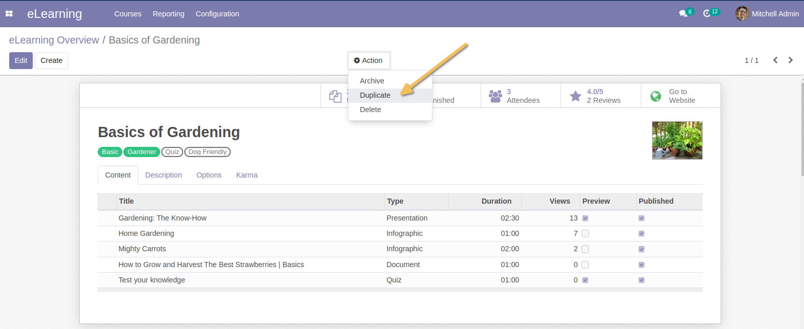
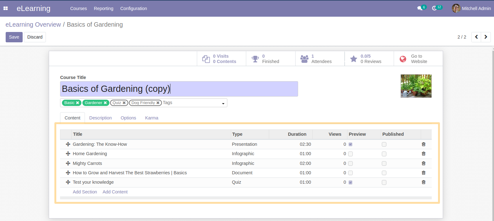

Website Slides Extended
==========================
This module allows to duplicate the content of a course.

Usage
-----
As a user with access to the e-Learning module, I access the form view of a course.
When I duplicate the course from the form/list view, I see that the content is also duplicated.

Contributors
------------
* Numigi (tm) and all its contributors (https://bit.ly/numigiens)
